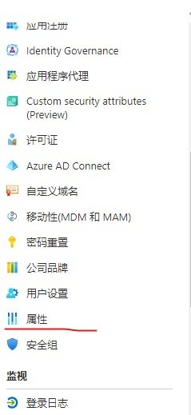
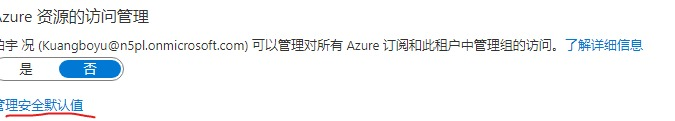

# Microsoft E5

## Microsoft E5 介绍

Microsoft 365 E5 将一流的生产力应用与高级安全性、合规性、语音和分析功能组合在一起。

• 使用集成的自动化安全措施扩展标识和威胁防护，帮助阻止破坏性攻击。

• 将信息保护和高级合规性功能整合在一起以保护和管理数据，同时降低风险。

• 在云中获取音频会议和呼叫功能，为团队提供支持。

• 利用 Power BI 功能，通过数据实现巨大的业务价值。

## 注册微软账号（如果你有可以跳过）

登录 [microsoft.com](microso.com)

点击右上角的小人

点击创建一个

点击获取新的电子邮件地址

输入后，点击下一步

输入密码

输入姓名

输入生日（一定要18岁以上）

回答证明你不是机器人

为了方便可以点‘是’

然后OK了

## 注册开发人员账号

上[developer.microsoft.com/zh-cn/microsoft-365?utm_source=developermscom](developer.microsoft.com/zh-cn/microsoft-365?utm_source=developermscom)

向下翻找到立即加入

国家填China 公司随便 语言选中文

接下来像我这样

接下来输入你的密码，数据中心的国家/地区和我一样就行咯

16个虚拟用户可以不选，就用管理员密码

填你的手机号

到这里，你就可以在office上登陆账号了

## 续订

注册github账号[github.com](github.com)

请自行度娘或点[这里](https://zhuanlan.zhihu.com/p/499364238)

注册完后就上[e5.qyi.io](e5.qyi.io)

点登录，点中间的小猫

点击绿色按钮（如果要登陆先登录）

不关掉这个页面，开新页面网址：[http://portal.azure.com/#blade/Microsoft_AAD_IAM/ActiveDirectoryMenuBlade/Registered/RegisteredApps](http://portal.azure.com/#blade/Microsoft_AAD_IAM/ActiveDirectoryMenuBlade/Registered/RegisteredApps)

回到仪表盘

登录这个

这里因为UP脑残记不住密码了，用了自己的E5

接下来像这样

在显示名称这里填outlook.api

在重定向URL这里选web，填https://e5.qyi.io/outlook/auth2/receive

点注册

复制应用程序Id

回到之前的页面

点新建

然后像我这样填，描述随便

再在client_id里粘贴

回到Azure

点证书和密码

点新客户端密码

像我这样

复制值

回到e5.qyi

复制进下一个

一直点到第三个，回到azure

点Api权限

点击添加权限

点击Microsoft Graph

点击应用程序权限

像我这样搜索mail，只点前四个（站长搞错了）

点确定后点代表组织同意

点这里

点这里

点这个

点

改为否，理由随便（up是第一个）

回到之前的页面

点确定就大功告成了
